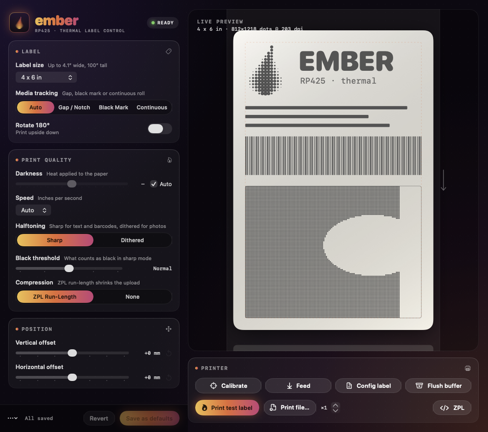
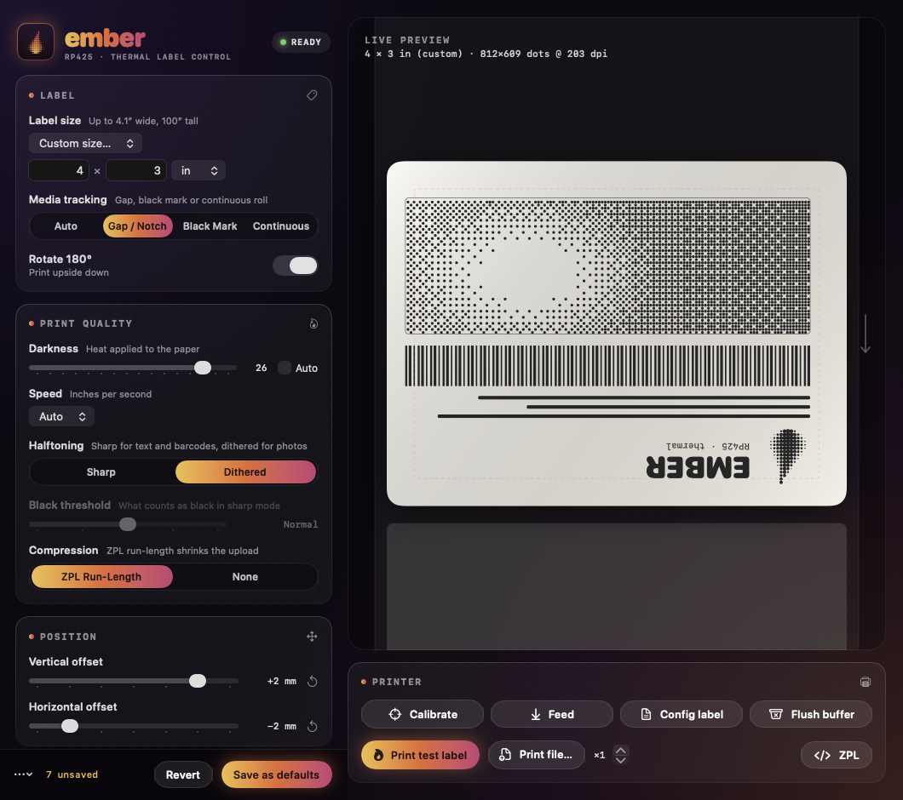

# rp425-driver

A small, vendor-free macOS driver for the **Rongta RP425** 4" thermal label printer — plus
**Ember**, a native app for changing every setting with a live preview of the label.

<p align="center"></p>

The printer identifies itself over USB as `0FE6:8800`,
`CMD:ZPL;MODEL:RP425(ZPL 203DPI)`, firmware `RP425,V1.11`. It speaks ZPL, so the
driver is:

| Piece | What it does |
|---|---|
| `src/rastertorp425.c` | CUPS filter. Turns CUPS raster into one ZPL label per page (`^GFA` graphic, ZPL run-length compressed, typically 5–15 % of raw size). |
| `ppd/RP425.ppd` | Label sizes (4×6 default, 4×8 down to 1.5×1, metric sizes, custom up to 4.1" × 100") and options. |
| `src/rp425.swift` | `rp425` CLI that talks to the printer over USB (IOUSBHost). Doesn't need CUPS. |
| `app/` | **Ember**, the SwiftUI settings app. |
| `ui/` | A browser-based settings page (stdlib Python) — an alternative to Ember. |

macOS's built-in `usb` backend handles transport, so no backend or kext is needed.

> **Status:** written for and tested on one printer (RP425, firmware V1.11) on macOS. Other
> Rongta/ZPL printers may work with PPD tweaks but are untested. This is an independent project,
> not affiliated with or endorsed by Rongta.

## Requirements

| | |
|---|---|
| macOS | 12+ for the driver and `rp425`; 13+ for Ember |
| To build | Xcode or the Command Line Tools (`xcode-select --install`): `clang`, `swiftc`, `make` |
| Web UI | the system `python3` (standard library only) |

Binaries are universal (arm64 + x86_64).

## Install the driver

```sh
make                 # universal binaries in build/
make test            # checks the filter's compression round-trips bit-exactly
sudo make install    # filter -> /Library/Printers/RP425, PPD, /usr/local/bin/rp425
sudo make queue      # adds a CUPS queue named "RP425" for the USB printer
```

Or add it in System Settings → Printers & Scanners: pick the RP425, then
"Select Software…" → **Rongta RP425 ZPL**.

Uninstall with `sudo make uninstall`.

## Ember — the settings app

```sh
make install-native    # builds build/Ember.app and copies it to ~/Applications
open ~/Applications/Ember.app
```

`make native` builds `build/Ember.app` without installing. The app is ad-hoc signed, not notarized,
so on first launch right-click it in Finder and choose **Open**. Remove it by deleting
`~/Applications/Ember.app`.

It needs the driver installed and a CUPS queue named `RP425` (see above).

**What it does**

- **Every option from the PPD:** label size (presets or custom), media tracking, darkness, speed,
  halftoning, black threshold, vertical/horizontal offset, rotate 180°, compression. The list is read
  from the queue's PPD, so it follows the driver.
- **Live preview:** a label drawn to scale that reacts as you change settings — size, darkness,
  sharp vs. dithered halftoning, threshold, offsets in real millimetres, rotation, and gap / black-mark /
  continuous media.
- **Save as defaults:** writes your choices to `~/.cups/lpoptions` (no root needed). Revert and
  "Restore driver defaults" are in the bar at the bottom; ⌘S saves.
- **Printer actions:** calibrate, feed, print the printer's config label, flush its buffer.
- **Test label:** prints a calibration label with a millimetre ruler on two edges (for dialling in the
  offsets), a gray ramp and a halftone field, using the sizes and settings currently on screen.
- **Print a file:** pick one or drop it on the preview (PDF, PNG, JPEG, GIF, text). `.zpl` files go raw.
- **Raw ZPL:** a small editor that sends ZPL through the queue.

<p align="center"></p>

**Notes**

- Settings you change are only applied to jobs printed through the queue once you **Save**; the test label,
  file printing and the preview use the values currently on screen either way.
- The printer actions talk to the USB device directly (through the bundled `rp425`), so they fail while a
  CUPS job is holding the printer. Printing, test labels and raw ZPL go through CUPS and are fine.
- The app carries its own copy of the PPD and `rp425`. Apps launched from Finder or Spotlight can't read
  an external volume, so nothing is looked up in the source tree at run time — re-run `make install-native`
  after changing either.
- The preview is an approximation of the printed result, not a render of it.

## Printing from the command line

```sh
lp -d RP425 label.pdf                              # 4x6 by default
lp -d RP425 -o PageSize=w288h144 label.pdf         # 4x2
lp -d RP425 -o Darkness=20 -o PrintSpeed=3 label.pdf
lp -d RP425 -o Dither=FloydSteinberg photo.png
lp -d RP425 -o raw label.zpl                       # your own ZPL, untouched
```

Options (`lpoptions -p RP425 -l` lists them all):

| Option | Values | ZPL |
|---|---|---|
| `PageSize` | `w288h432` (4×6), `w288h576`, `w288h288`, `w288h144`, … `Custom.WxHin` | `^PW` / `^LL` |
| `MediaTracking` | `Default`, `Gap`, `Mark`, `Continuous` | `^MN` |
| `Darkness` | `Default`, `0`–`30` | `~SD` |
| `PrintSpeed` | `Default`, `2`–`6` in/s | `^PR` |
| `Dither` | `Threshold` (sharp barcodes), `FloydSteinberg` (photos) | – |
| `Threshold` | `64` … `192` | – |
| `TopOffset` / `LeftOffset` | ±3 mm in 1 mm steps (dots) | `^LT` / `^LS` |
| `Rotate180` | `False`, `True` | `^POI` |
| `Compression` | `ZPL`, `None` | – |

`Default` leaves the printer's own setting alone. ZPL settings such as `^MN` stay in
effect until the printer is power-cycled.

## The `rp425` tool

```sh
rp425 info          # USB device ID and firmware
rp425 calibrate     # re-measure label/gap length (~JC); do this after changing stock
rp425 feed          # feed one label (~PH)
rp425 config        # print the configuration label (~WC)
rp425 send x.zpl    # raw ZPL straight to USB, bypassing CUPS (`-` reads stdin)
rp425 cancel        # flush the printer's buffer (~JA)
rp425 status        # ~HS, on firmware that answers it
```

`rp425` opens the USB interface directly, so it can't run while a CUPS job is
using the printer.

## Web settings UI (alternative to Ember)

```sh
make ui        # or: python3 ui/rp425-ui.py [--printer RP425] [--port 8425]
```

Opens a page on `127.0.0.1:8425` with every option from the table above, plus the
`rp425` actions (test label, feed, calibrate, config label, flush), a raw-ZPL box, and a
custom label size. Changes are saved as your own defaults for the queue
(`lpoptions`, in `~/.cups/lpoptions`, no root needed); "Reset to defaults" removes them.
It uses only the Python standard library and talks to the printer through CUPS, so the
printer actions that use USB directly (`feed`, `calibrate`, `config`, `info`) fail while
a CUPS job is holding the printer.

`make app` builds `~/Applications/RP425 Settings.app`: open it from Spotlight or drag it to the
Dock and it starts the server (if needed) and opens the page. Use the page's **Quit** button
to stop the server.

## Troubleshooting

| Symptom | Likely cause / fix |
|---|---|
| Ember shows **NO QUEUE** | No CUPS queue named `RP425`. Run `sudo make queue`, or add it in System Settings. |
| Ember's option list is empty | The PPD couldn't be read from `/etc/cups/ppd/RP425.ppd` or the app bundle. Reinstall the driver, then `make install-native`. |
| Calibrate / Feed / Config / Flush fail with "not found on USB" | The printer is off or unplugged, or a CUPS job is holding the USB interface. Wait for the queue to drain (`lpstat -o`) and retry. |
| Labels print with the wrong size or drift | Run **Calibrate** after changing stock, and set **Media tracking** to match it (gap, black mark, continuous). |
| Content is shifted | Print the test label and read the offset off the millimetre ruler; adjust the offsets. |
| macOS lists the printer as "Unknown" | Expected, see the firmware quirks below. Choose the driver by hand or use `sudo make queue`. |
| "Ember can't be opened" | It is ad-hoc signed. Right-click → Open once. |

## Firmware quirks found while probing (V1.11)

- `MFG` in the 1284 device ID is empty and the model is sent as `MODEL` rather than
  `MDL`, so macOS lists the printer as "Unknown" and probably won't auto-select this
  driver. Choose it by hand, or use `sudo make queue`.
- It answers `~HI`, but not `~HS`, `~HQES`, `~HD`, `^HH`, or the USB printer-class
  `GET_PORT_STATUS` request (stalls). So there's no paper-out/head-open status over USB.
- Bulk-IN reads that time out leave the pipe out of sync for the next process;
  `rp425` clears both pipes on open.

## Development

```
src/rastertorp425.c     CUPS filter (raster -> ZPL)
src/rp425.swift         USB CLI
ppd/RP425.ppd           options and label sizes (the single source of truth: Ember and the web UI read it)
app/Sources/            Ember (SwiftUI)
  PPD.swift               PPD parser, custom-size handling
  Backend.swift           lpoptions / lpstat / lp / rp425 wrappers (no shell; arguments are never re-parsed)
  Store.swift             app state: values vs. saved defaults, actions, toasts
  LabelPreview.swift      the to-scale preview
  TestLabel.swift         the printed calibration label (CoreGraphics PDF)
  Brand.swift             colors, the halftone flame mark, shared controls
  ContentView.swift       the window
app/build.sh            builds the universal, signed Ember.app
app/tools/makeicon.swift  draws the app icon
ui/rp425-ui.py          web settings UI
test/                   filter round-trip test, test-label generator
docs/                   README images
```

- `make test-print` encodes `test/mkpdf.swift`'s test label and sends it straight to the printer
  without installing anything.
- `build/rastertorp425 1 user title 1 "" file.ras` runs the filter by hand. Get a raster file with
  `cupsfilter -p ppd/RP425.ppd -m application/vnd.cups-raster in.pdf > in.ras`.
- Ember can render itself headlessly for screenshots and checks:
  `build/Ember.app/Contents/MacOS/Ember --snapshot out.png [Key=Value …]` writes a PNG and exits. Values
  override settings for that render (e.g. `Dither=FloydSteinberg Rotate180=True`), and
  `EMBER_SNAPSHOT_SIZE=1060x940` sets the capture size. Run it with a throwaway `HOME` to be sure it
  never reads your real `~/.cups/lpoptions`.
